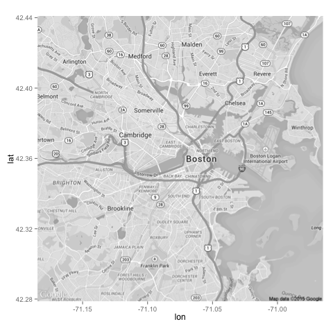
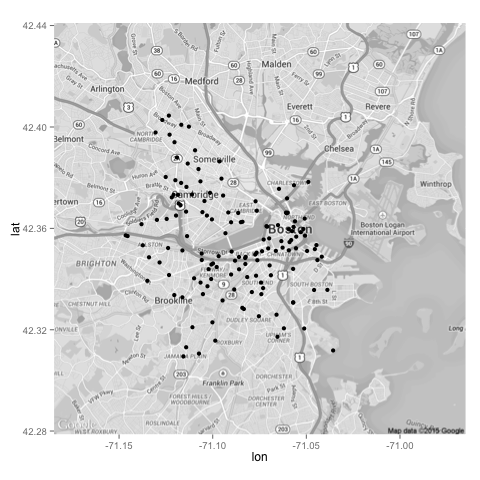
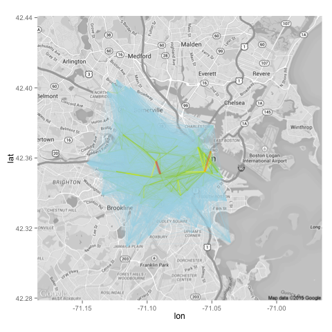
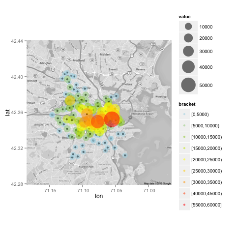
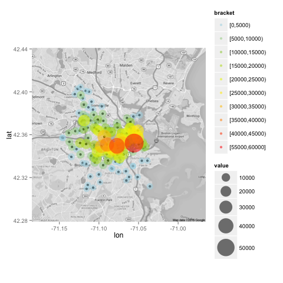
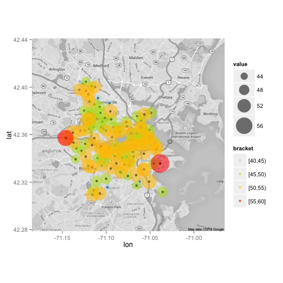
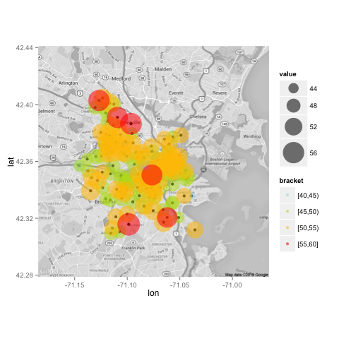

<h1>Visualizing Hubway Data</h1>

<h2>Introduction</h2>
<p>While browsing around for a new geospatial data project, I came across the <a href='http://hubwaydatachallenge.org/' target='_blank'>Hubway Data Visualization Challenge</a>. Hubway is a bicycle rental company that has stations throughout in Boston and the surrounding areas. The competition has already closed but the data was still available through the site. Having lived in Boston for a few years, I decided to play around with the data.</p>

<h2>Objective</h2>
<p>In this writing, I will try to document the steps that I took to create my rendering of geospatial visualizations of Hubway's bicycle data. I won't go line-by-line through the code because the scripts are already in the Github repository. Most of the code snippets that you'll see are of custom functions that I wrote. If you're interested in seeing how exactly the code works, please refer to the script file in the repository.</p>

<h2>About the data</h2>
<p>There are two datasets: <b>stations.csv</b> and <b>trips.csv</b>. The stations dataset contains information about the bike stations. The trips dataset contains information about each trip. The datasets contained data from July of 2011 to November of 2013.</p>

<p>The datasets can be downloaded from the <a href="http://hubwaydatachallenge.org/" target="_blank">Hubway Data Visualization Challenge website</a>.</p>

<h2>Load Data and Libraries</h2>
```
loadData()
loadLibraries()
```

The stations dataset:<br />
<TABLE border=1>
<TR> <TH> id </TH> <TH> terminal </TH> <TH> station </TH> <TH> municipal </TH> <TH> lat </TH> <TH> lng </TH> <TH> status </TH>  </TR>
  <TR> <TD align="right">      3 </TD> <TD> B32006 </TD> <TD> Colleges of the Fenway </TD> <TD> Boston </TD> <TD align="right"> 42.34002 </TD> <TD align="right"> -71.10081 </TD> <TD> Existing </TD> </TR>
  <TR> <TD align="right">      4 </TD> <TD> C32 </TD> <TD> Tremont St. at Berkeley St. </TD> <TD> Boston </TD> <TD align="right"> 42.34539 </TD> <TD align="right"> -71.06962 </TD> <TD> Existing </TD> </TR>
  <TR> <TD align="right">      5 </TD> <TD> B32012 </TD> <TD> Northeastern U / North Parking Lot </TD> <TD> Boston </TD> <TD align="right"> 42.34181 </TD> <TD align="right"> -71.09018 </TD> <TD> Existing </TD> </TR>
  <TR> <TD align="right">      6 </TD> <TD> D32 </TD> <TD> Cambridge St. at Joy St. </TD> <TD> Boston </TD> <TD align="right"> 42.36129 </TD> <TD align="right"> -71.06514 </TD> <TD> Existing </TD> </TR>
  <TR> <TD align="right">      7 </TD> <TD> A32 </TD> <TD> Fan Pier </TD> <TD> Boston </TD> <TD align="right"> 42.35341 </TD> <TD align="right"> -71.04462 </TD> <TD> Existing </TD> </TR>
  <TR> <TD align="right">      8 </TD> <TD> A32001 </TD> <TD> Union Square - Brighton Ave. at Cambridge St. </TD> <TD> Boston </TD> <TD align="right"> 42.35333 </TD> <TD align="right"> -71.13731 </TD> <TD> Existing </TD> </TR>
   </TABLE>
  
The trips dataset:<br />
<TABLE border=1>
<TR> <TH> hubway_id </TH> <TH> duration </TH> <TH> start_date </TH> <TH> strt_statn </TH> <TH> end_date </TH> <TH> end_statn </TH> <TH> bike_nr </TH> <TH> subsc_type </TH> <TH> birth_date </TH> <TH> gender </TH>  </TR>
  <TR> <TD align="right">     17 </TD> <TD align="right">   1108 </TD> <TD> 2011-07-28 11:55:00 </TD> <TD> 47 </TD> <TD> 2011-07-28 12:13:00 </TD> <TD> 40 </TD> <TD> B00550 </TD> <TD> Registered </TD> <TD> 1994 </TD> <TD> Male </TD> </TR>
  <TR> <TD align="right">     18 </TD> <TD align="right">   1055 </TD> <TD> 2011-07-28 11:55:00 </TD> <TD> 47 </TD> <TD> 2011-07-28 12:13:00 </TD> <TD> 40 </TD> <TD> B00580 </TD> <TD> Registered </TD> <TD> 1956 </TD> <TD> Male </TD> </TR>
  <TR> <TD align="right">     19 </TD> <TD align="right">   1042 </TD> <TD> 2011-07-28 11:55:00 </TD> <TD> 47 </TD> <TD> 2011-07-28 12:12:00 </TD> <TD> 40 </TD> <TD> B00539 </TD> <TD> Registered </TD> <TD> 1959 </TD> <TD> Female </TD> </TR>
  <TR> <TD align="right">     23 </TD> <TD align="right">    994 </TD> <TD> 2011-07-28 12:00:00 </TD> <TD> 40 </TD> <TD> 2011-07-28 12:16:00 </TD> <TD> 47 </TD> <TD> B00368 </TD> <TD> Casual </TD> <TD>  </TD> <TD>  </TD> </TR>
  <TR> <TD align="right">     27 </TD> <TD align="right">    952 </TD> <TD> 2011-07-28 12:00:00 </TD> <TD> 40 </TD> <TD> 2011-07-28 12:16:00 </TD> <TD> 23 </TD> <TD> B00556 </TD> <TD> Registered </TD> <TD> 1944 </TD> <TD> Male </TD> </TR>
  <TR> <TD align="right">     29 </TD> <TD align="right">   1261 </TD> <TD> 2011-07-28 12:00:00 </TD> <TD> 22 </TD> <TD> 2011-07-28 12:21:00 </TD> <TD> 45 </TD> <TD> B00454 </TD> <TD> Registered </TD> <TD> 1975 </TD> <TD> Male </TD> </TR>
   </TABLE>

<h2>Aggregation Process</h2>

<p>Because the trips dataset contained rows of individual trips, I needed to perform some aggregation. I wanted to know:</p>
<ul>
<li>Number of trips for each station-to-station pair</li>
<li>Bumber of incoming trips for each station</li>
<li>Bumber of outgoing trips for each station</li>
<li>Bumber of total trips (both incoming and outgoing) for each station</li>
<li>Percentage of incoming trips for each station</li>
<li>Percentage of outgoing trips for each station</li>
</ul>

<p>After creating the two aggregation datasets, for plotting purposes, I also had to add longitude and latitude information by matching up the station IDs against the station IDs in the stations dataset.</p>

```
## aggregate the number of trips for each station-to-station pair
trAggS2S <- aggTripsS2S(trips)  # aggregate counts for each station-to-station pair
trAggS2S <- addStartAndEndLocs(trAggS2S, stations)

## aggregate the number of incoming/outgoing/total trips and their respective percentages by station
byStnMetric <- aggTripCntByStn(trAggS2S, stations)  # aggregate counts for each station
byStnMetric <- addIncOutTripPercs(byStnMetric)  # calculate percentages
byStnMetric <- addStnLocs(byStnMetric, stations)  # add longitude/latitude info
```

<p>The resulting aggregated datasets looked like this</p>
trAggS2S dataset:<br />
<TABLE border=1>
<TR> <TH> strt_statn </TH> <TH> end_statn </TH> <TH> cnt </TH> <TH> strtLng </TH> <TH> strtLat </TH> <TH> endLng </TH> <TH> endLat </TH>  </TR>
  <TR> <TD> 145 </TD> <TD> 139 </TD> <TD align="right">      9 </TD> <TD align="right"> -71.12041 </TD> <TD align="right"> 42.394 </TD> <TD align="right"> -71.12302 </TD> <TD align="right"> 42.39697 </TD> </TR>
  <TR> <TD> 145 </TD> <TD> 76 </TD> <TD align="right">     11 </TD> <TD align="right"> -71.12041 </TD> <TD align="right"> 42.394 </TD> <TD align="right"> -71.10550 </TD> <TD align="right"> 42.36643 </TD> </TR>
  <TR> <TD> 145 </TD> <TD> 74 </TD> <TD align="right">     12 </TD> <TD align="right"> -71.12041 </TD> <TD align="right"> 42.394 </TD> <TD align="right"> -71.11858 </TD> <TD align="right"> 42.37327 </TD> </TR>
  <TR> <TD> 145 </TD> <TD> 77 </TD> <TD align="right">     12 </TD> <TD align="right"> -71.12041 </TD> <TD align="right"> 42.394 </TD> <TD align="right"> -71.09641 </TD> <TD align="right"> 42.38643 </TD> </TR>
  <TR> <TD> 145 </TD> <TD> 137 </TD> <TD align="right">     14 </TD> <TD align="right"> -71.12041 </TD> <TD align="right"> 42.394 </TD> <TD align="right"> -71.11908 </TD> <TD align="right"> 42.38799 </TD> </TR>
  <TR> <TD> 145 </TD> <TD> 71 </TD> <TD align="right">     16 </TD> <TD align="right"> -71.12041 </TD> <TD align="right"> 42.394 </TD> <TD align="right"> -71.10759 </TD> <TD align="right"> 42.38341 </TD> </TR>
   </TABLE>

byStnMetric dataset:<br />
<TABLE border=1>
<TR> <TH> statn </TH> <TH> inc_cnt </TH> <TH> out_cnt </TH> <TH> tot_cnt </TH> <TH> inc_perc </TH> <TH> out_perc </TH> <TH> lng </TH> <TH> lat </TH>  </TR>
  <TR> <TD> 3 </TD> <TD align="right">   8788 </TD> <TD align="right">   9262 </TD> <TD align="right">  18050 </TD> <TD align="right"> 48.69 </TD> <TD align="right"> 51.31 </TD> <TD align="right"> -71.10081 </TD> <TD align="right"> 42.34002 </TD> </TR>
  <TR> <TD> 4 </TD> <TD align="right">  16862 </TD> <TD align="right">  17447 </TD> <TD align="right">  34309 </TD> <TD align="right"> 49.15 </TD> <TD align="right"> 50.85 </TD> <TD align="right"> -71.06962 </TD> <TD align="right"> 42.34539 </TD> </TR>
  <TR> <TD> 5 </TD> <TD align="right">  10397 </TD> <TD align="right">   9969 </TD> <TD align="right">  20366 </TD> <TD align="right"> 51.05 </TD> <TD align="right"> 48.95 </TD> <TD align="right"> -71.09018 </TD> <TD align="right"> 42.34181 </TD> </TR>
  <TR> <TD> 6 </TD> <TD align="right">  21720 </TD> <TD align="right">  22387 </TD> <TD align="right">  44107 </TD> <TD align="right"> 49.24 </TD> <TD align="right"> 50.76 </TD> <TD align="right"> -71.06514 </TD> <TD align="right"> 42.36129 </TD> </TR>
  <TR> <TD> 7 </TD> <TD align="right">   8158 </TD> <TD align="right">   8438 </TD> <TD align="right">  16596 </TD> <TD align="right"> 49.16 </TD> <TD align="right"> 50.84 </TD> <TD align="right"> -71.04462 </TD> <TD align="right"> 42.35341 </TD> </TR>
  <TR> <TD> 8 </TD> <TD align="right">   7395 </TD> <TD align="right">   6890 </TD> <TD align="right">  14285 </TD> <TD align="right"> 51.77 </TD> <TD align="right"> 48.23 </TD> <TD align="right"> -71.13731 </TD> <TD align="right"> 42.35333 </TD> </TR>
   </TABLE>

<h2>Visualization Process</h2>

<h5>Getting a Map of Boston</h5>

<p>Initially, I wanted to plot my visuals on a colored map. But as soon as I start plotting colored lines and bubbles over the map, I quickly realized that the additional colors in the background were very distracting and took away from the main points of my visualization work. So I decided to go black-and-white.</p>

```
boston <- get_map(location = c(-71.075, 42.36), 
                  zoom=12, maptype='roadmap', color='bw') 
boston <- ggmap(boston)
```

<h5>Plotting Stations</h5>

<p>Instead having a single base map that combines the map of Boston and that of all the bike stations, I decided to make a separate function to plot just the bike stations since I may want to plot the stations at the top instead of having them at the bottom, obscured by other visualization work.</p>

<br />

```
boston <- getBostonMap()
boston
```

<br />

```
plotStations(boston)
```

<h5>Trips from Stations to Stations</h5>

<p>As I dabbled with plotting lines between stations, I realized that the task was trickier than I initially conceived. There were 15091 rows in the aggregated <b>trAggS2S</b> dataset, which meant that there were 15091 data points for unique station-to-station pairs. So whenever I plotted all the lines between stations, it created a giant blob which made it impossible to understand which lines represented high frequency connections.</p>

<p>By using the cut() function, I created a separate group variable derived from the connections count. So for example, any station-to-station pair with connections count between 0 and 100 would have [0, 100) as its bracket. Based on this count bracket, I color-coded the lines differently.</p>

<p>Even when I color-coded the lines, the rare high-frequency connection lines were obscured behinded the more abundant low-frequency connection lines. Through Google search, I found these two posts, which I found helpful.</p> 

<ul>
<li><a href="http://paulbutler.org/archives/visualizing-facebook-friends/" target="_blank">Visualizing Facebook Friends: Eye Candy in R</a> by Paul Butler</li>
<li><a href="http://flowingdata.com/2011/05/11/how-to-map-connections-with-great-circles/" target="_blank">How to map connections with great circles</a> by Nathan Yau</li>
</ul>

<p>Basically, the trick was to plot the low-frequency connections first before plotting the high-frequency connections. Using Nathan Yau's plotting function as a base model, I created a similiar implementation using the ggplot2 package.</p> 

<p>Nation had a clever way of picking colors for the lines based on their connection counts using the RColorBrewer package, which I also adopted in my implementation. I created a spectrum of colors from light blue to light green to yellow to orange to red to paint the lines.</p>

<p>In Nathan's model, he looped through each station-to-station pair, calculated the intermediate points between the two stations on a great circle and plotted a line through the points. This made sense for his project because he was visualizing flights data, which spanned over greater distances (e.g. from New York to Los Angeles instead of from Street A to Street B within Boston). By calculating the intermediate points on great circles and plotting lines through them, he was able to produce nice archs.</p>

<p>However, for me, calculating the intermeidate points produced no benefit. Because each line was connecting two points that were very close to each other, any arch in the line was inperceptible and it appeared to be just like a straight line. If anything, the extra computation of calculating the intermediate points on a great circle slowed down the plotting process.</p>

<p>In addition, Nathan used a for-loop to loop through each station-to-station pair. But for-loops are notorious for being slow and verbose. I wanted to implement a plot function without using a loop. This is the final plotting function that I came up with:</p>

```
## plot trip lines 
plotTripLines <- function(plot, trAggDF, lwRng=c(0.2, 1.5), alpha=0.2) {

  ## melt wide-format df to long-format
  trAggDF <- meltTripAggDF(trAggDF)
  
  ## order df
  trAggDF <- trAggDF[order(trAggDF$cnt), ]

  ## calculate color based on count
  colors <- colorRampPalette(c("lightblue", "yellowgreen", "yellow", "orange", "red"))(n = 60)
  trAggDF <- addColorsBasedCnt(trAggDF, colors)

  ## calculate line width between the given range based on count
  trAggDF <- addLineWidthsBasedCnt(trAggDF, lwRng)

  ## draw plot
  plot <- plot + 
    geom_line(data=trAggDF, aes(x=lng, y=lat,
                                group=interaction(strt_statn, end_statn, cnt)), 
              alpha=alpha,
              color=trAggDF$color, size=trAggDF$lw)

  ## return
  return(plot)
}
```

<p>In addition to using only the colors, I also decided to use different line widths to convey the connection frequencies; the thicker the line, the higher travel frequency between two stations. This was the resulting plot.</p>

<br />

<h5>Stations by Number of Incoming Trips</h5>

<br />

<h5>Stations by Number of Outgoing Trips</h5>

<br />

<h5>Stations by Percentages of Incoming Trips</h5>

<br />

<h5>Stations by Percentages of Outgoing Trips</h5>

<br />


<h2>Future Plans</h2>
<ol>
<li>Create an interactive visualization tool using the <a href='http://shiny.rstudio.com/' target='_blank'>shiny</a> package.</li>
<li>Aggregate and visualize by day of the week, time of the day, date, month, year, customer type, customer gender, customer age group, etc.</li>
<li>Experiment with <a href='http://rstudio.github.io/leaflet/' target='_blank'>leaflet</a> and <a href='http://cran.r-project.org/web/packages/leafletR/leafletR.pdf' target='_blank'>leafletR</a> packages.</li>
<li>Calculate and visualize the number and percentage of self-looped trips by station</li>
<li>Visualize station-to-station connection pairs that disproportional in-flow vs. out-flow.</li>
</ol>

<h2>Links</h2>
<ul>
<li><a href="http://hubwaydatachallenge.org/" target="_blank">Hubway Data Visualization Challenge</a></li>
<li><a href="http://paulbutler.org/archives/visualizing-facebook-friends/" target="_blank">Visualizing Facebook Friends: Eye Candy in R</a></li>
<li><a href"http://flowingdata.com/2011/05/11/how-to-map-connections-with-great-circles/" target="_blank">How to map connections with great circles</a></li>
</ul>
